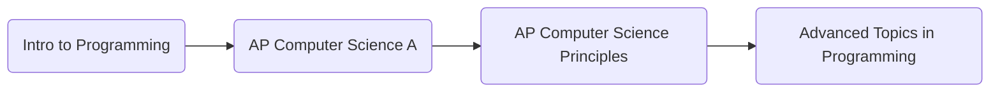

# Background
I learned recursion in a course offered at my high school. All programs are written with recursion. 

These are the courses I took:  

# What I learned
Drawing/writing out test-cases and working backwards immensely helped in my approach in solving these recursive problems. Through these recursive exercises, I learned how essential pseudocode and brainstorming are when approaching a problem, as they allow the programmer to visualize test-cases, edge-cases, and have a strong grasp on what they are trying to solve.

 This repo includes severals projects I worked on using what I learned. 

