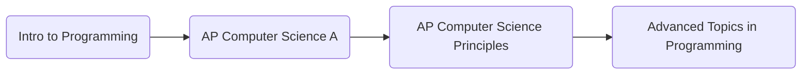

# Background
I learned recursion in a course offered at my high school. These are programs I wrote answering the prompt given. All programs are written with recursion. 

These are the courses I took:  

# What I learned
Recursion is a lot harder than you think. Through practice, though, it's easier to detect problems and determine how to write the recursive part and the base cases involved. Recursion may be hard, but it's also very fun once you understand how it works.

